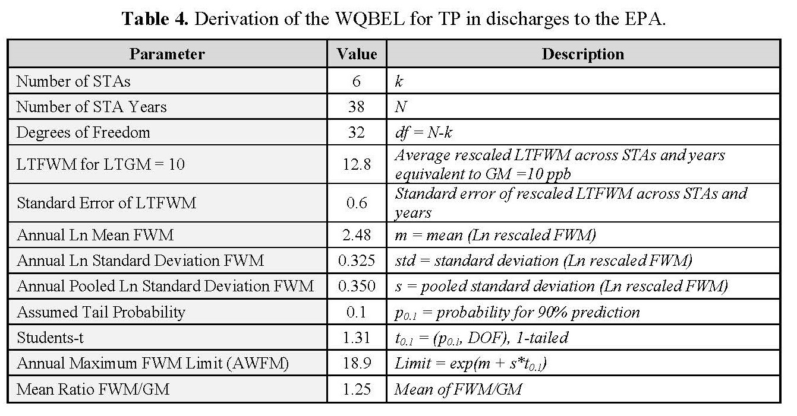
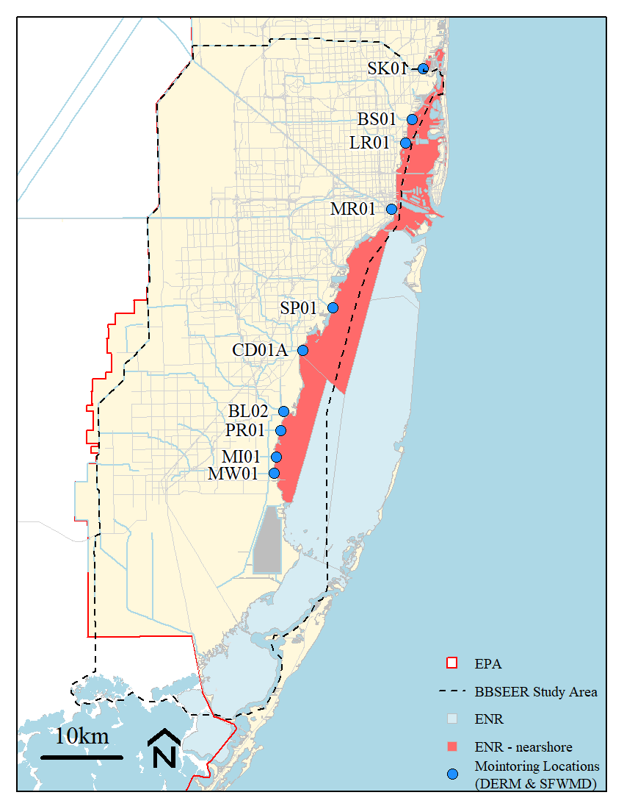
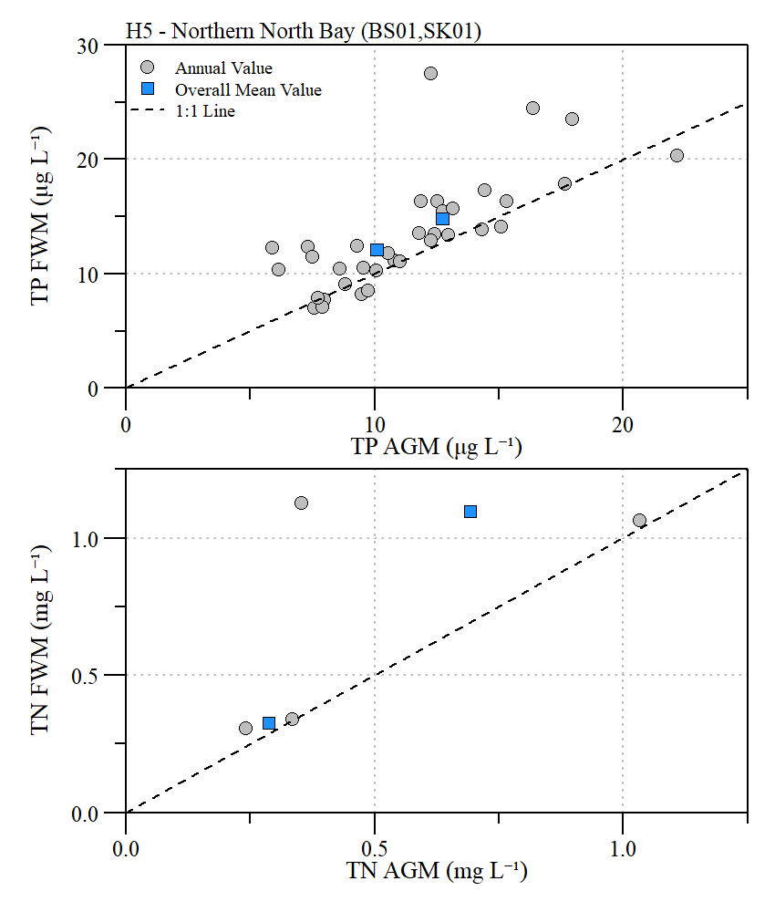
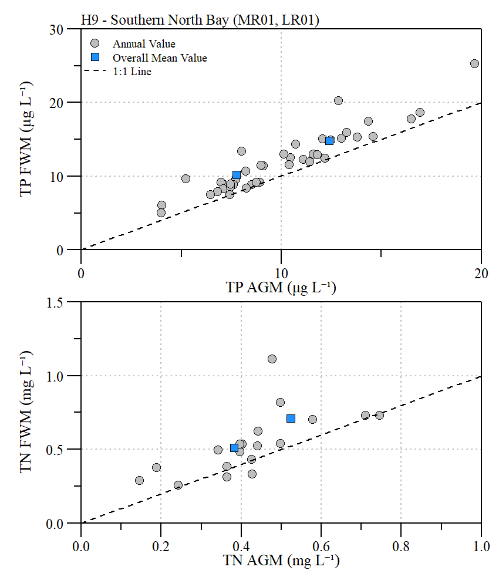
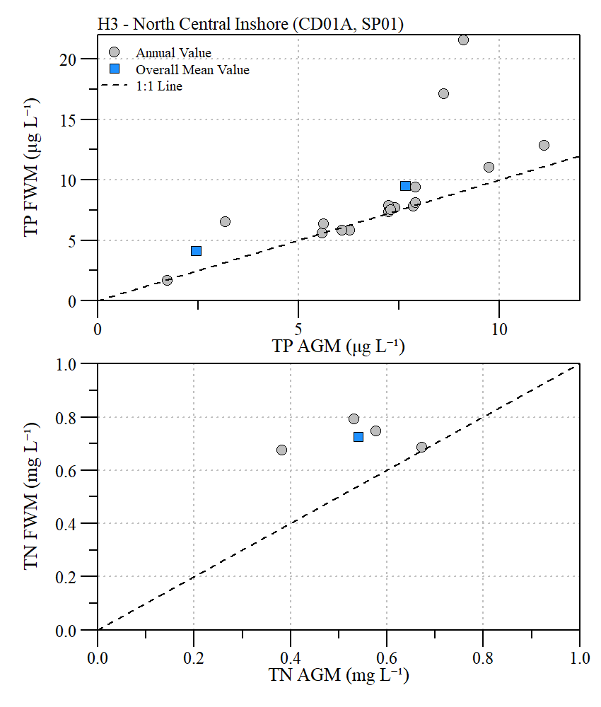
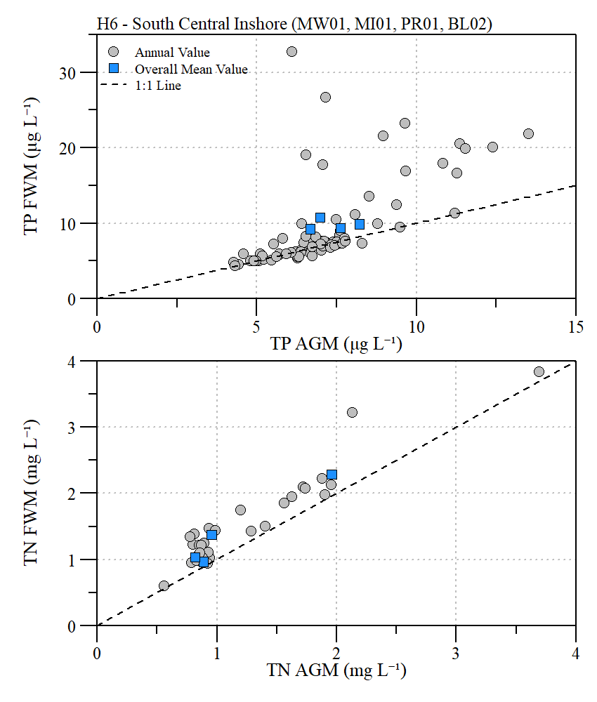

```{r setup, include=FALSE}
library(knitr)
library(fontawesome)

options(htmltools.dir.version = FALSE)
knitr::opts_chunk$set(warning = FALSE, message = FALSE, echo=FALSE)

# tables
library(flextable)
library(magrittr)
# library(kableExtra)

```

layout: true

<div class="my-footer">
<span>DRAFT</span>
</div>

<!-- <div class="watermark">DRAFT</div> -->

---
name: xaringan-title
class: left, middle

### Biscayne Bay Southeastern Everglades Ecosystem Restoration<br>(WQ Subteam)

#### DRAFT - .fancy[Water Quality Planning Targets]

<!--.large[<font color="white">Paul Julian, PhD | `r format(Sys.Date(),"%B %d,%Y")`</font>]-->

FDEP - Office of Water Policy and Ecosystem Restoration

`r format(as.Date(Sys.Date()),"%B %d, %Y")`

<!-- this ends up being the title slide since seal = FALSE-->


---
name: Obj
class: left

### Objective
- Evalute the potential for developing planning level water quality targes from project areas to downstream OFW

### Approach
- Rescale existing water quality at discharge locations to established downstream Numeric Nutrient Criteria ([62-302.532 FAC](https://www.flrules.org/gateway/RuleNo.asp?title=SURFACE%20WATER%20QUALITY%20STANDARDS&ID=62-302.532)).
- Similar approach to Everglades Stormwater Treatment Area WQBEL ([Technical Support Document](./resources/wqbel_sfwmd_tsd Final issued.pdf)).

---
name: QBEL
class:left

### STA WQBEL

```{r out.width="80%",fig.align="center"}

```


**Everglades WQBEL**

  - 13 `r paste("\u03BCg L\u207B\u00B9")` as an annual FWM in more than three out of five years and; 

  - 19 `r paste("\u03BCg L\u207B\u00B9")` as an annual FWM.

.footnote[
.small[([Source](./resources/wqbel_sfwmd_tsd Final issued.pdf))]
]

---
name: BBSSER
class: left

.pull-left[

<br>
<br>

```{r out.width="100%",fig.align="center"}

```


]

.pull-right[

**Estuary-Specific Numeric Interpretations of the Narrative Nutrient Criterion**

62-302.532(1) FAC. Estuary-Specific Numeric Interpretations of the Narrative Nutrient Criterion.

```{r,echo=F}

BB.nnc.tab=data.frame(Estuary=c(rep("(h) Biscayne Bay",9)),
                   Segement=c("1. Card Sound","2. Manatee Bay - Barnes Sound","3. North Central Inshore","4. North Central Outer-Bay","5. Northern North Bay","6. South Central Inshore", "7. South Central Mid-Bay","8. South Central Outer-Bay","9. Southern North Bay"),
                   TP=c(0.008,0.007,0.007,0.008,0.012,0.007,0.007,0.006,0.010),
                   TN=c(0.33,0.58,0.31,0.28,0.30,0.48,0.35,0.24,0.29),
                   Chla=c(0.5,0.4,0.5,0.7,1.7,0.4,0.2,0.2,1.1))
vars=c("3. North Central Inshore","5. Northern North Bay","6. South Central Inshore","9. Southern North Bay")
flextable(BB.nnc.tab)%>%
  merge_v(j=~Estuary)%>%
  valign(j=1,valign="top")%>%
  fix_border_issues()%>%
  bold(part="header")%>%
  font(fontname = "serif",part="all")%>%
  fontsize(size=8,part="body")%>%
  fontsize(size=9,part="header")%>%
  align(j=1:2,align="left",part="all")%>%
  align(j=3:5,align="center",part="all")%>%
  set_header_labels("TP"="Total\nPhosphorus\n(mg L\u207B\u00B9)",
                    "TN"="Total\nNitrogen\n(mg L\u207B\u00B9)",
                    "Chla"="Chlorophyll-a\n(\u03BCg L\u207B\u00B9)")%>%
  width(width=c(1.5,7,1.75,1.75,1.5))%>%
  footnote(i=1,j=3:5,part="header",
           value=as_paragraph(" Criteria expressed as annual geometric means (AGM) are not to be exceeded more than once in a three year period."),
           ref_symbols = c(" A"))%>%
#  set_caption(caption="62-302.532(1) FAC. Estuary-Specific Numeric Interpretations of the Narrative Nutrient Criterion.")%>%
  bg(i=~Segement%in%vars,bg=adjustcolor("indianred2",0.5))

```
]

---
name: Methods
class:left

### Methods

#### Data Sources
- Water quality data was retrieved from FDEP STORET $^{1}$, WIN $^{2}$ and SFWMD DBHYDRO $^{3}$.

- Daily discharge data retrieved from SFWMD DBHYDRO $^{3}$.

- Period of record considered May 1999 - May 2019 (Florida WY2000 - 2020).

#### Data Handling
- Fatally qualified data were removed prior to analysis.

- Values reported less than the minimum detection limit (MDL) were set to $\frac{1}{2}$ the MDL.

- Annual (Florida WY) geometric mean (GM) concentrations were computed on days of flow with greater than four samples per year and atleast one in the dry and wet season.

- Flow-weighted mean (FWM) concentrations were calculated using paired WQ and flow data.

.footnote[
.small[
$^{1}$ [STORET](https://prodenv.dep.state.fl.us/DearSpa/public/welcome); $^{2}$ [WIN](https://prodenv.dep.state.fl.us/DearWin/public/welcomeGeneralPublic?calledBy=GENERALPUBLIC); 
$^{3}$ [DBHYDRO](https://my.sfwmd.gov/dbhydroplsql/show_dbkey_info.main_menu)
]
]

---
name: Methods2
class:left

### Methods

.pull-left[
*Data Rescaling*

\begin{align*}
RF = \frac{NNC}{\overline{GM}}
\end{align*}

\begin{align*}
\overline{GM} = \frac{\sum^{n}_{i=1}GM}{n}
\end{align*}

\begin{align*}
FWM_{RF} = FWM \times RF
\end{align*}


.small[Where,

NNC = long-term numeric nutrient criterion limit for specific region

GM = geometric mean for each year at each station

$\overline{GM}$ = arithmetic mean of geometric mean at each station for n years

n = number of years per site

FWM = annual FWM calculated for each site]

]

.pull-right[

*Statistical Analysis*

\begin{align*}
y_{ij} = ln(C_{ij})
\end{align*}

\begin{align*}
m = \frac{\sum_{i=1}^{k}\sum_{i=1}^{n_i} y_{ij}}{N}
\end{align*}

<!-- \begin{align*} -->
<!-- S^{2} = \frac{\sum_{i=1}^{k} \left[ \sum_{j=1}^{n_i} \left(y_{ij} - \bar{y_{i}}\right)^{2} \right]}{N-k} -->
<!-- \end{align*} -->

\begin{align*}
S_{y} = \sqrt{\frac{\sum_{i=1}^{k} \left[ \sum_{j=1}^{n_i} \left(y_{ij} - \bar{y_{i}}\right)^{2} \right]}{N-k}}
\end{align*}

\begin{align*}
df = N - k
\end{align*}

\begin{align*}
L_{\rho} = \frac{m + S_{y}\times t_{\rho}}{\sqrt{N}}
\end{align*}

.small[.small[
Where,

$C_{ij}$ = FWM for year *j* and site *i*, rescaled to NNC <br>
$\bar{y_{i}}$ = mean ln(FWM) for site *i* across years <br>
N = total number of site years <br>
k = number of sites <br>
m = mean of log nutrient data across sites and years (rescaled FWM) <br>
$S_{y}$ = pooled year-to-year standard deviation <br>
df = degrees of freedom in s <br>
$L_{p}$ = long-term limit FWM concentration with exceedance probability $\rho$ <br>
$t_{p}$ = 1-tailed t-statistic, significance level $\rho$ and df <br>

]]

]

---
name: NNCH5
class: left

### ENRH5 Northern North Bay

.pull-left[

```{r,echo=F}

read.csv("./Exports/H5NNC_rescale.csv")%>%
  flextable()%>%
  colformat_num(i=1:4,j=2,digits=0)%>%
  colformat_num(i=c(5:7,11),j=2,digits=2)%>%
  colformat_num(i=8:9,j=2,digits=3)%>%
  colformat_num(i=10,j=2,digits=1)%>%
  colformat_num(i=12,j=2,digits=0)%>%
  colformat_num(i=1,j=3,digits=2)%>%
  colformat_num(i=2:4,j=3,digits=0)%>%
  colformat_num(i=c(5:7,11),j=3,digits=2)%>%
  colformat_num(i=8:9,j=3,digits=3)%>%
  colformat_num(i=10,j=3,digits=1)%>%
  colformat_num(i=12,j=3,digits=2)%>%
  width(width=c(2.25,1,1))%>%
  add_header(Value.TP="Total\nPhosphorus\n(\u03BCg L\u207B\u00B9)",
             Value.TN="Total\nNitrogen\n(mg L\u207B\u00B9)")%>%
  set_header_labels("Value.TP"="Value","Value.TN"="Value")%>%
  align(j=2:3,align="center",part="all")%>%
  font(fontname = "serif",part="all")%>%
  fontsize(size=10,part="body")%>%
  fontsize(size=12,part="header")%>%
  bold(part="header")
  


```

<p style="color:red;"> <b>LIMITED TN DATA </b></p>

]

.pull-right[


```{r out.width="100%",fig.align="center"}

```

]

---
name: NNCH9
class: left

### ENRH9 Southern North Bay

.pull-left[

```{r,echo=F}

read.csv("./Exports/H9NNC_rescale.csv")%>%
  flextable()%>%
  colformat_num(i=1:4,j=2,digits=0)%>%
  colformat_num(i=c(5:7,11),j=2,digits=2)%>%
  colformat_num(i=8:9,j=2,digits=3)%>%
  colformat_num(i=10,j=2,digits=1)%>%
  colformat_num(i=12,j=2,digits=0)%>%
  colformat_num(i=1,j=3,digits=2)%>%
  colformat_num(i=2:4,j=3,digits=0)%>%
  colformat_num(i=c(5:7,11),j=3,digits=2)%>%
  colformat_num(i=8:9,j=3,digits=3)%>%
  colformat_num(i=10,j=3,digits=1)%>%
  colformat_num(i=12,j=3,digits=2)%>%
  width(width=c(2.25,1,1))%>%
  add_header(Value.TP="Total\nPhosphorus\n(\u03BCg L\u207B\u00B9)",
             Value.TN="Total\nNitrogen\n(mg L\u207B\u00B9)")%>%
  set_header_labels("Value.TP"="Value","Value.TN"="Value")%>%
  align(j=2:3,align="center",part="all")%>%
  font(fontname = "serif",part="all")%>%
  fontsize(size=10,part="body")%>%
  fontsize(size=12,part="header")%>%
  bold(part="header")
  


```


]

.pull-right[


```{r out.width="100%",fig.align="center"}

```

]

---
name: NNCH3
class: left

### ENRH3 North Central Inshore

.pull-left[

```{r,echo=F}

read.csv("./Exports/H3NNC_rescale.csv")%>%
  flextable()%>%
  colformat_num(i=1:4,j=2,digits=0)%>%
  colformat_num(i=c(5:7,11),j=2,digits=2)%>%
  colformat_num(i=8:9,j=2,digits=3)%>%
  colformat_num(i=10,j=2,digits=1)%>%
  colformat_num(i=12,j=2,digits=0)%>%
  colformat_num(i=1,j=3,digits=2)%>%
  colformat_num(i=2:4,j=3,digits=0)%>%
  colformat_num(i=c(5:7,11),j=3,digits=2)%>%
  colformat_num(i=8:9,j=3,digits=3)%>%
  colformat_num(i=10,j=3,digits=1)%>%
  colformat_num(i=12,j=3,digits=2)%>%
  width(width=c(2.25,1,1))%>%
  add_header(Value.TP="Total\nPhosphorus\n(\u03BCg L\u207B\u00B9)",
             Value.TN="Total\nNitrogen\n(mg L\u207B\u00B9)")%>%
  set_header_labels("Value.TP"="Value","Value.TN"="Value")%>%
  align(j=2:3,align="center",part="all")%>%
  font(fontname = "serif",part="all")%>%
  fontsize(size=10,part="body")%>%
  fontsize(size=12,part="header")%>%
  bold(part="header")
  


```

<p style="color:red;"> <b>LIMITED TN DATA </b></p>

]

.pull-right[


```{r out.width="100%",fig.align="center"}

```

]

---
name: NNCH6
class: left

### ENRH6 South Central Inshore

.pull-left[

```{r,echo=F}
read.csv("./Exports/H6NNC_rescale.csv")%>%
  flextable()%>%
  colformat_num(i=1:4,j=2,digits=0)%>%
  colformat_num(i=c(5:7,11),j=2,digits=2)%>%
  colformat_num(i=8:9,j=2,digits=3)%>%
  colformat_num(i=10,j=2,digits=1)%>%
  colformat_num(i=12,j=2,digits=0)%>%
  colformat_num(i=1,j=3,digits=2)%>%
  colformat_num(i=2:4,j=3,digits=0)%>%
  colformat_num(i=c(5:7,11),j=3,digits=2)%>%
  colformat_num(i=8:9,j=3,digits=3)%>%
  colformat_num(i=10,j=3,digits=1)%>%
  colformat_num(i=12,j=3,digits=2)%>%
  width(width=c(2.25,1,1))%>%
  add_header(Value.TP="Total\nPhosphorus\n(\u03BCg L\u207B\u00B9)",
             Value.TN="Total\nNitrogen\n(mg L\u207B\u00B9)")%>%
  set_header_labels("Value.TP"="Value","Value.TN"="Value")%>%
  align(j=2:3,align="center",part="all")%>%
  font(fontname = "serif",part="all")%>%
  fontsize(size=10,part="body")%>%
  fontsize(size=12,part="header")%>%
  bold(part="header")
  


```


]

.pull-right[


```{r out.width="100%",fig.align="center"}

```

]


