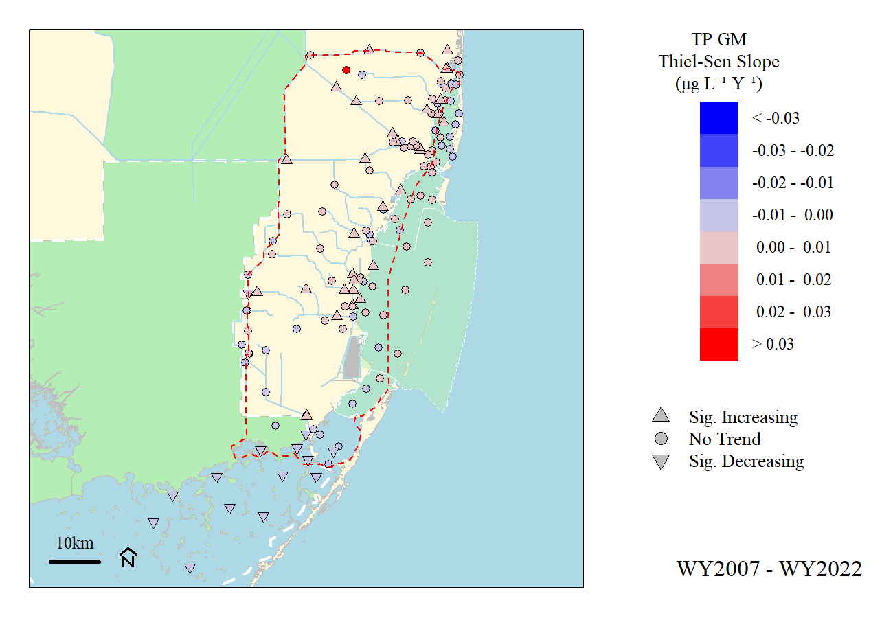
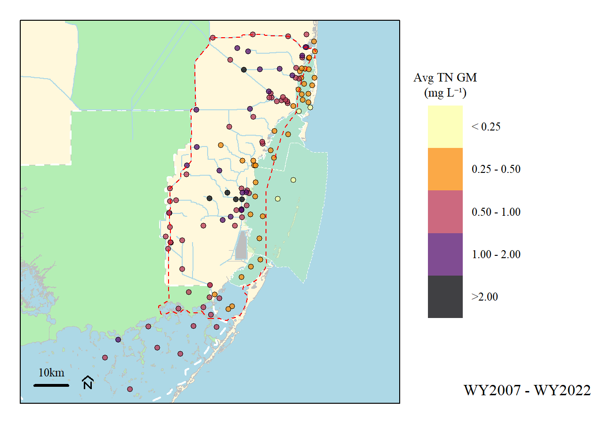
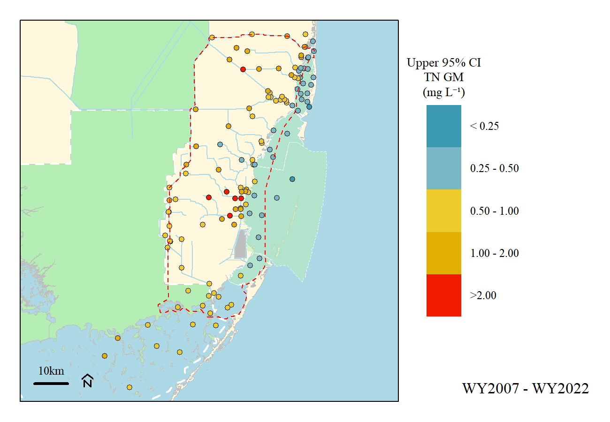
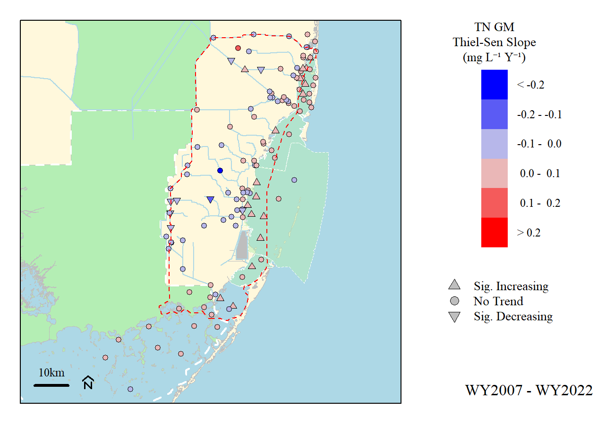

```{r xaringanExtra, include=FALSE, warnint=FALSE}
# devtools::install_github("gadenbuie/xaringanExtra")
# xaringanExtra::use_webcam()
xaringanExtra::use_tile_view()
# xaringanExtra::use_scribble()
# xaringanExtra::use_progress_bar("red", "bottom","0.25em")
```

```{r setup, include=FALSE}
library(AnalystHelper)
library(knitr)
library(fontawesome)

options(htmltools.dir.version = FALSE)
knitr::opts_chunk$set(warning = FALSE, message = FALSE, echo=FALSE)

# tables
library(flextable)
library(magrittr)
# library(kableExtra)

plot.path="C:/Julian_LaCie/_GitHub/BBSEER_WQ/Plots/"

plot.figs=list.files(plot.path,full.names=F)
# grepl("BBSEER_WQ",plot.figs)
plot.figs=paste0(plot.path,plot.figs[grepl("BBSEER_WQ",plot.figs)==T])
slides.figs="C:/Julian_LaCie/_GitHub/BBSEER_WQ/slides/WQPlots"
file.copy(plot.figs,slides.figs,overwrite=T,recursive=T)

draft.date=date.fun("2023-05-02")
```

layout: true

<div class="my-footer">
<span>DRAFT</span>
</div>

<!-- <div class="watermark">DRAFT</div> -->

---
name: xaringan-title
class: left, middle

### Biscayne Bay Southeastern Everglades Ecosystem Restoration<br>(WQ Subteam)

#### DRAFT - .fancy[Water Quality Evaluation]

.footnote[
Paul Julian PhD<br>[`r fontawesome::fa("fas fa-envelope")`](mailto: pjulian@evergaldesfoundation.org) .small[pjulian@evergaldesfoundation.org]

`r if(draft.date!=date.fun(Sys.Date())){paste(format(draft.date,"%B %d, %Y"),"<br>(Updated:", format(as.Date(Sys.Date()),"%B %d, %Y"),")")}else{paste(format(draft.date,"%B %d, %Y"))}`

.small[Use cursor keys for navigation, press .red["O"] for a slide .red[O]verview]

```{r} 
# bsplus::bs_button(
#     label = "Download PDF Version",
#     button_type = "primary",
#     button_size = "small") %>%
#     htmltools::a(
#       href = "https://swampthingecology.org/BBSEER_WQ/slides/BBSEER_WQEval.pdf"
#       )
```
]
---
name: Obj
class: left

### Objective
- Review and evaluate existing surface water quality across the BBSEER project area using available data.

### Approach
- Evaluate data from SFWMD (DBHydro) and Miami-Dade County’s Division of Environmental Resources Management between May 2006 to April 2022 (WY2007 - 2022).
- Calculate annual geometric mean (AGM) Total Phosphorus (TP) and Total Nitrogen (TN) concentrations 
    - Must have at least three years of continuous data, and
    - a minimum of 4 samples per year with at least one sample in wet and dry seasons
    - where possible (for structures) GM were calculated using data on days with observed discharge (some adjustment is possible).
    
- Average AGM and upper 95% confidence interval values were calculated for each monitoring location
- Mann-Kendall trend and Thiel Sen slope were also evaluated
    
---
name: AGM TP

### Total Phosphorus - Average AGM

<br>

```{r out.width="90%",fig.align="center"}

```

---
name: UCI TP

### Total Phosphorus - Upper 95% CI of Avg AGM

<br>

```{r out.width="90%",fig.align="center"}

```

---
name: Trend TP

### Total Phosphorus - Long Term Trend

<br>

```{r out.width="90%",fig.align="center"}

```

---
name: AGM TN

### Total Nitrogen - Average AGM

<br>

```{r out.width="90%",fig.align="center"}

```

---
name: UCI TN

### Total Nitrogen - Upper 95% CI of Avg AGM

<br>

```{r out.width="90%",fig.align="center"}

```

---
name: Trend TN

### Total Nitrogen - Long Term Trend

<br>

```{r out.width="90%",fig.align="center"}

```

---
name: Trend TN

### Summary

- High level look at surface water quality by integrating multiple data sets together (>100 monitoring locations used)

- Very little difference in average and upper 95% CI geometric mean TP and TN concentrations (w/ some exceptions)
  
- Significant monotonic changes in TP and TN concentrations were detected
  - 31 locations significantly increases TP concentration (most in coastal region)
  - 14 locations significantly decreasing TP concentration (S332C & FLAB sites)
  - 17 locations significantly increases TN concentration (most in Biscayne Bay)
  - 8 locations significantly decreasing TN concentration (L31N and Biscayne Bay)

- Some locations did not see statistically significant changes but remarkable change overtime (i.e. BS11)

- Some locations did not see change over time (i.e. near zero slope) but concentrations remain relatively elevated.

- Additional evaluation is needed (including additional data sources if possible)

---
name: last slide
class: left

### Acknowledgements

#### Data

```{r ,out.width="8%"}
knitr::include_graphics("https://www.sfwmd.gov/sites/default/files/documents/sfwmd-seal-hq.png")
```
South Florida Water Management District ([DBHYDRO](https://www.sfwmd.gov/science-data/dbhydro))

```{r ,out.width="8%"}
knitr::include_graphics("https://www.miamidade.gov/global_assets/templates_v6/images/logo.png")
```
Miami-Dade Department of Environmental Resources Management via <br> [FDEP STORET/WIN](https://floridadep.gov/dear/watershed-services-program/content/winstoret)


#### Slides

* Slide deck - [HTML](http://swampthingecology.org/BBSEER_WQ/slides/BBSEER_WQEval.html) | [PDF](http://swampthingecology.org/BBSEER_WQ/slides/BBSEER_WQEval.pdf) | &copy; Julian (2023) [](http://creativecommons.org/licenses/by/4.0/)

* RMarkdown [Source](https://github.com/SwampThingPaul/BBSEER_WQ/slides)

<br>

<center><font color="red">Draft Work Product</font><br>In support of BBSEER planning</center>


