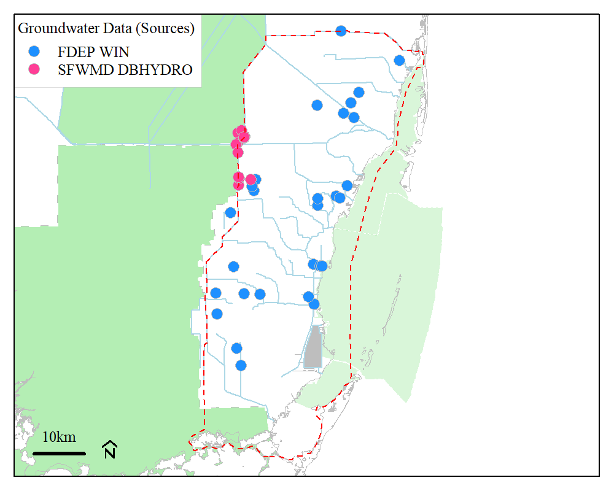
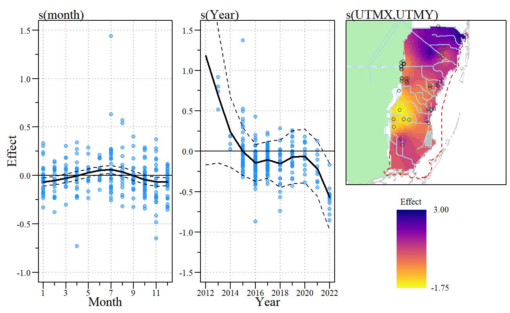
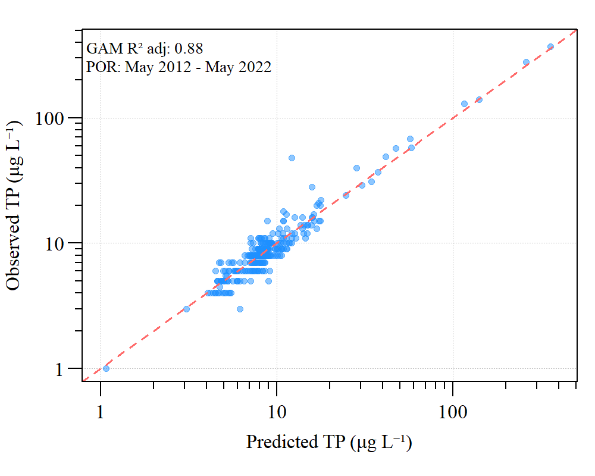
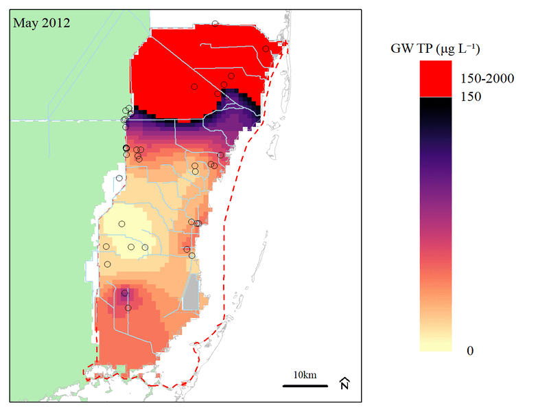
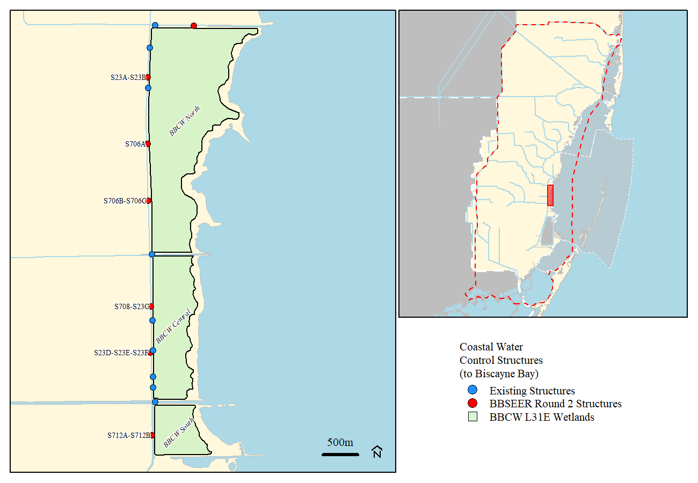
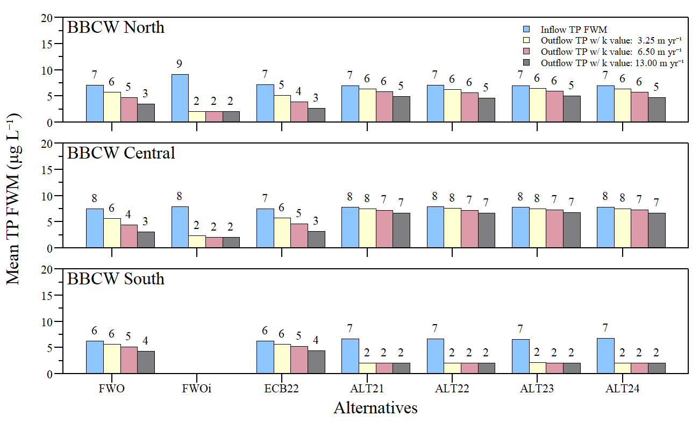
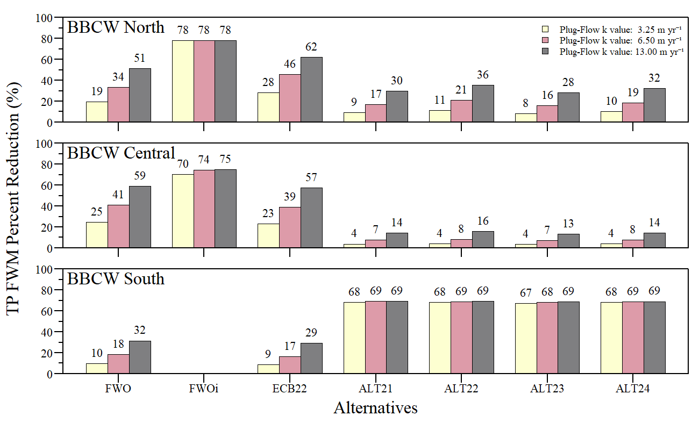

```{r xaringanExtra, include=FALSE, warnint=FALSE}
# devtools::install_github("gadenbuie/xaringanExtra")
# xaringanExtra::use_webcam()
xaringanExtra::use_tile_view()
# xaringanExtra::use_scribble()
# xaringanExtra::use_progress_bar("red", "bottom","0.25em")
```

```{r setup, include=FALSE}
library(AnalystHelper)
library(knitr)
library(fontawesome)

options(htmltools.dir.version = FALSE)
knitr::opts_chunk$set(warning = FALSE, message = FALSE, echo=FALSE)

# tables
library(flextable)
library(magrittr)
# library(kableExtra)

plot.path="C:/Julian_LaCie/_GitHub/BBSEER_WQ/Plots/WQLoadEval/"

plot.figs=list.files(plot.path,full.names=F)
# grepl("BBSEER_WQ",plot.figs)
plot.figs=paste0(plot.path,plot.figs)
slides.figs="C:/Julian_LaCie/_GitHub/BBSEER_WQ/slides/WQPlots_LoadRnd2"
file.copy(plot.figs,slides.figs,overwrite=T,recursive=T)

draft.date=date.fun("2023-05-22")

## Functions 
notidy_glance_gam<-function(model,...){
  data.frame(
    df=sum(model$edf),
    df.residual=stats::df.residual(model),
    logLik=as.numeric(stats::logLik(model)),
    AIC = stats::AIC(model),
    BIC = stats::BIC(model),
    adj.r.squared=summary(model)$r.sq,
    deviance=summary(model)$dev.expl,
    nobs = stats::nobs(model),
    method=as.character(summary(model)$method),
    sp.crit=as.numeric(summary(model)$sp.criterion),
    scale.est=summary(model)$scale
  )
}

notidy_tidy_gam<-function(model,dig.num=2,...){
  ptab <- data.frame(summary(model)$p.table)
  ptab$term<-rownames(ptab)
  rownames(ptab)=NULL
  ptab$Component="A. parametric coefficients"
  ptab<-ptab[,c(6,5,1:4)]
  colnames(ptab) <- c("Component","Term", "Estimate", "Std.Error", "t.value", "p.value")
  ptab$p.value=with(ptab,ifelse(p.value<0.01,"<0.01",round(p.value,2)))
  ptab[,3:5]=format(round(ptab[,3:5],dig.num),nsmall=dig.num)
  ptab
  
  stab= data.frame(summary(model)$s.table)
  stab$term<-rownames(stab)
  rownames(stab)=NULL
  stab$Component="B. smooth terms"
  stab<-stab[,c(6,5,1:4)]
  colnames(stab) <- c("Component","Term", "edf", "Ref. df", "F.value", "p.value")
  stab$p.value=with(stab,ifelse(p.value<0.01,"<0.01",round(p.value,2)))
  stab[,3:5]=format(round(stab[,3:5],dig.num),nsmall=dig.num)
  stab
  
  ptab.cnames = c("Component","Term", "Estimate", "Std Error", "t-value", "p-value")
  stab.cnames = c("Component","Term", "edf", "Ref. df", "F-value", "p-value")
  
  colnames(ptab) = c("A", "B", "C", "D")
  if (ncol(stab) != 0) {
    colnames(stab) = colnames(ptab)
  }
  tab = rbind(ptab, stab)
  colnames(tab) = ptab.cnames
  
  tab2 = rbind(c(ptab.cnames), tab[1:nrow(ptab), ])
  if (nrow(stab) > 0) {
    tab2 = rbind(tab2, c(stab.cnames), tab[(nrow(ptab) + 1):nrow(tab), ])
  }
  
  tab2
}

notidy_as_flextable_gam<-function(x=NULL,data_t=NULL,data_g=NULL,dig.num=2,r2dig=2,brd.lwd=1.25,...){
  # needs flextable
  # magrittr
  if(sum(class(x)%in%c("gam"))==1&is.null(data_t)&is.null(data_g)){
    data_t <- notidy_tidy_gam(x)
    data_g <- notidy_glance_gam(x)
  }
  
  std_border=officer::fp_border(color = "black", style = "solid", width = brd.lwd)
  data.frame(data_t)%>%
    flextable()%>%
    delete_part(part="header")%>%
    hline(i=which(data_t=="Component"),border=std_border)%>%
    hline(i=which(data_t=="Component")[2]-1,border=std_border)%>%
    bold(i=which(data_t=="Component"))%>%
    align(j=1,part="all")%>%
    hline_top(border=std_border)%>%
    hline_bottom(border=std_border)%>%
    merge_v(j=1)%>%valign(j=1,valign="top")%>%fix_border_issues()%>%
    autofit(part = c("header", "body"))%>%
    add_footer_lines(values = c(
      sprintf("Adjusted R-squared: %s, Deviance explained %s", formatC(data_g$adj.r.squared,digits = r2dig,format="f"), formatC(data_g$deviance,digits = r2dig,format="f")),
      paste0(data_g$method,": ",format(round(data_g$sp.crit,dig.num),dig.num),", Scale est.: ",format(round(data_g$scale.est,dig.num),dig.num),", N: ",data_g$nobs)
    ))
}

```

layout: true

<div class="my-footer">
<span>DRAFT</span>
</div>

<!-- <div class="watermark">DRAFT</div> -->

---
name: xaringan-title
class: left, middle

### Biscayne Bay Southeastern Everglades Ecosystem Restoration<br>(WQ Subteam)

#### DRAFT - .fancy[Water Quality Evaluation - Groundwater and BBCW evaluation]

.footnote[
Paul Julian PhD<br>[`r fontawesome::fa("fas fa-envelope")`](mailto: pjulian@evergaldesfoundation.org) .small[pjulian@evergaldesfoundation.org]

`r if(draft.date!=date.fun(Sys.Date())){paste(format(draft.date,"%B %d, %Y"),"<br>(Updated:", format(as.Date(Sys.Date()),"%B %d, %Y"),")")}else{paste(format(draft.date,"%B %d, %Y"))}`

.small[Use cursor keys for navigation, press .red["O"] for a slide .red[O]verview]

```{r} 
# bsplus::bs_button(
#     label = "Download PDF Version",
#     button_type = "primary",
#     button_size = "small") %>%
#     htmltools::a(
#       href = "https://swampthingecology.org/BBSEER_WQ/slides/BBSEER_WQEval.pdf"
#       )
```
]
---
name: Obj
class: left

### Objective
- Evaluate available groundwater total phosphorus concentrations within BBSEER project area
- Apply basic kC* model to Biscayne Bay Coastal Wetlands (L31E)

### Approach
- Groundwater evaluation
  - FDEP WIN and SFWMD DBHYDRO data (Jan 2012 - Dec 2022) 
  - Spatial and temporal generalized additive models
  - Model was fit using month, year and lat/long. 
  
- Biscayne Bay Coastal Wetland kC* evaluation
  - Applied basic kC* equation to estimated FWM concentrations for wetland segment inflow to estimate potential outflow concentration
  - Focused on L31E wetlands 
    - does not considered tidal effects


```{r} 
library(downloadthis)

tmp=read.csv("C:/Julian_LaCie/_GitHub/BBSEER_WQ/Exports/BBSEER_ann_struct_flows.csv")
download_this(tmp,
    output_name = "BBSEER_ann_struct_flows",
    output_extension = ".csv",
    button_label = "Download Annual Loads as .csv",
    button_type = "primary",
    has_icon = TRUE,
    icon = "fa fa-file-csv"
  )

```
    
---
name: Groundwater 

### Groundwater Data

```{r out.width="65%",fig.align="center"}

```

* Several sites had only one sample for the entire period of record. 
  - 10 monitoring locations had more than one TP sample  (limited data)
  - 283 TP samples for ~ 10 year period.
  - well/sample depth not consistently recorded. 

---
name: GW GAM

#### Conceptual GAM framework

To evaluate the seasonality and/or change in groundwater TP concentrations we want to model the following features of the data:

1. any trend or long term change in the TP concentration, 
2. any seasonal or within-year variation, 
3. any spatial variation, 
4. any variation or interaction in the trend and seasonal features, and 
5. ~~any potential drivers (i.e. well/sample depth, water level, Cl/SPC)~~

The general equation would look something like this

$$
\begin{align*}
  \begin{split}
    y_{t} & = \alpha + s(month) + s(Yr) + s(UTMX,UTMY) + \\
      & \quad ti(month, Yr) + \\
      & \quad ti(UTMX,UTMY,month) + \\
      & \quad ti(UTMX,UTMY,Yr)
  \end{split}
\end{align*}
$$

---
name: GW GAM RSLT Table

### GW GAM effect plots

```{r out.width="80%",fig.align="center"}

```

- ** Does not include interaction effect plots **

---
name: GW GAM RSLT Table

### Model Results 

```{r}
library(flextable)
library(magrittr)
library(mgcv)

load("C:/Julian_LaCie/_GitHub/BBSEER_WQ/Exports/BBSEER_GW_GAM.RData")
  
notidy_as_flextable_gam(m1a)%>%
  compose(i=c(1,3),j=6,as_paragraph("\u03C1-value"))%>%
  compose(i=5,j=2,as_paragraph("s(Year)"))%>%
  compose(i=6,j=2,as_paragraph("ti(DoY,Year)"))%>%
  padding(padding=1.5,part="all")%>%
  font(fontname="Times New Roman",part="all")%>%
  fontsize(size=9,part="all")

```


```{r out.width="40%",fig.align="center"}

```

---
name: GW GAM Animation

### Predicted GW TP concentration

```{r out.width="70%",fig.align="center"}

```

- Does not account for sample depth
- Based on relatively limited data (still search for more to add)
- Does show spatial and temporal differences over a nearly 10 year period

---
name: BBCW kC

### Biscayne Bay Coastal Wetland (L31E)

```{r out.width="85%",fig.align="center"}

```

- BBCW North = S23A, S23B, S706A, S706B and S706C
- BBCW Central = S708, S23C, S23D, S23E and S23F
- BBCW South = S712A and S712B

---
name: BBCW kC

### Biscayne Bay Coastal Wetland (L31E)

- Eastern boundary delineated using a combination of elevation and vegetation characteristics from aerial imagery
- Modeling does not account for tidal effects (i.e. tidal inflow, tidal pumping of groundwater to surface water, potential recirculation of seawater due to SLR, etc.)
- Model evaluated using a series of removal rate term (k) values due to uncertainty of appropriate value 

$$ 
\begin{align*}
C_{o} = C^{*}+\left(C_{i}-C^{*}\right)\times \exp-\frac{k}{Q_{i}\times A}
\end{align*}
$$

  - Flow and load combined for each BBCW segment to estimate total TP FWM concentration ( $C_{i}$ )
  - Background concentration ( $C^{*}$ ) assumed to be 2 `r paste0("\u03BCg L\u207B\u00B9")`
  - Annual total discharge was estimated for $Q_{i}$
  
```{r}
data.frame(Wetland=c("BBCW N","BBCW C","BBCW S"),Area=c(689,278,112))%>%
  flextable()%>%
  set_header_labels("Wetland"="Wetland\nSegment",
                    "Area"="Area\n(Acres)")%>%
  padding(padding=1.5,part="all")%>%
  align(j=2,part="all",align="center")%>%
  width(width=c(1,0.5))%>%
  font(fontname="Times New Roman",part="all")%>%
  fontsize(size=10,part="all")

```

---
name: BBCW kC

### Biscayne Bay Coastal Wetland (L31E)


```{r out.width="85%",fig.align="center",fig.cap="Average annual flow-weighted mean concentration for each wetland segment over the period of simulation"}

```

---
name: BBCW kC

### Biscayne Bay Coastal Wetland (L31E)

```{r out.width="85%",fig.align="center",fig.cap="Percent TP FWM reduction (inflow to outflow) for each alterantive and k-value"}

```


---
name: last slide
class: left

### Acknowledgements

#### Data

```{r ,out.width="8%"}
knitr::include_graphics("https://www.sfwmd.gov/sites/default/files/documents/sfwmd-seal-hq.png")
```
South Florida Water Management District ([DBHYDRO](https://www.sfwmd.gov/science-data/dbhydro))

```{r ,out.width="8%"}
knitr::include_graphics("https://www.miamidade.gov/global_assets/templates_v6/images/logo.png")
```
Miami-Dade Department of Environmental Resources Management via <br> [FDEP STORET/WIN](https://floridadep.gov/dear/watershed-services-program/content/winstoret)


#### Slides

* Slide deck - [HTML](http://swampthingecology.org/BBSEER_WQ/slides/BBSEER_WQEval_GW_BBCWRnd2.html) | [PDF](http://swampthingecology.org/BBSEER_WQ/slides/BBSEER_WQEval_GW_BBCWRnd2.pdf) | &copy; Julian (2023) [](http://creativecommons.org/licenses/by/4.0/)

* RMarkdown [Source](https://github.com/SwampThingPaul/BBSEER_WQ/slides)

<br>

<center><font color="red">Draft Work Product</font><br>In support of BBSEER planning</center>


