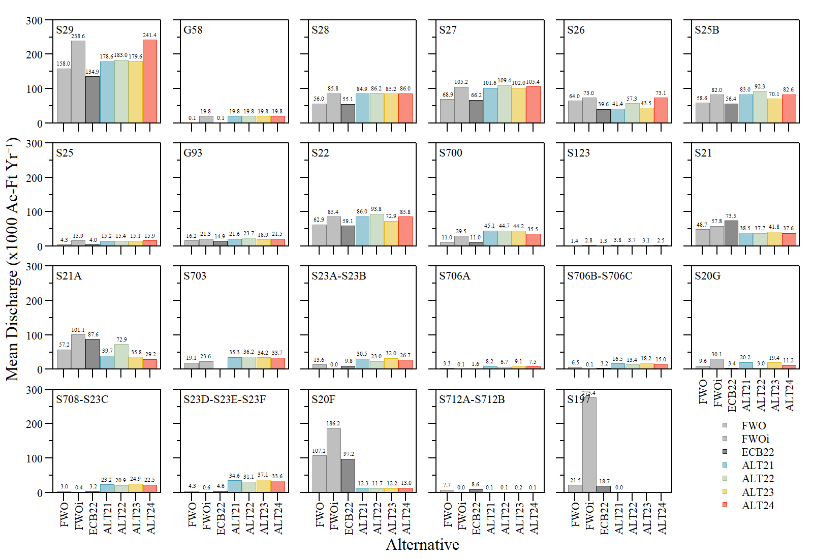
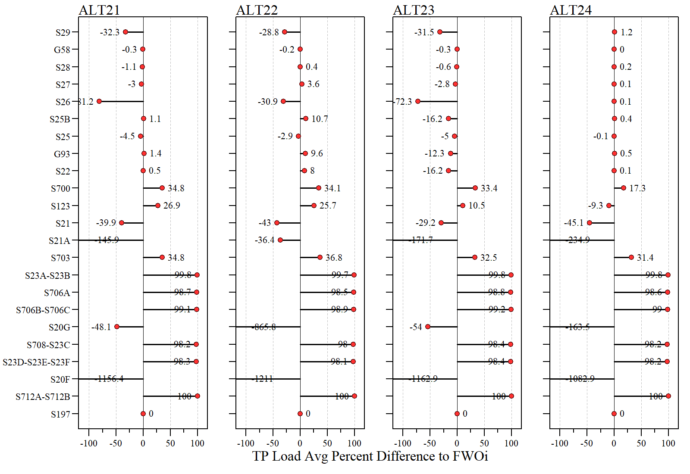
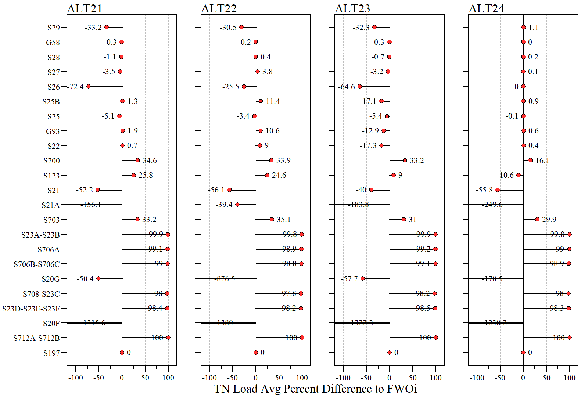

```{r xaringanExtra, include=FALSE, warnint=FALSE}
# devtools::install_github("gadenbuie/xaringanExtra")
# xaringanExtra::use_webcam()
xaringanExtra::use_tile_view()
# xaringanExtra::use_scribble()
# xaringanExtra::use_progress_bar("red", "bottom","0.25em")
```

```{r setup, include=FALSE}
library(AnalystHelper)
library(knitr)
library(fontawesome)

options(htmltools.dir.version = FALSE)
knitr::opts_chunk$set(warning = FALSE, message = FALSE, echo=FALSE)

# tables
library(flextable)
library(magrittr)
# library(kableExtra)

plot.path="C:/Julian_LaCie/_GitHub/BBSEER_WQ/Plots/WQLoadEval/"

plot.figs=list.files(plot.path,full.names=F)
# grepl("BBSEER_WQ",plot.figs)
plot.figs=paste0(plot.path,plot.figs)
slides.figs="C:/Julian_LaCie/_GitHub/BBSEER_WQ/slides/WQPlots_LoadRnd2"
file.copy(plot.figs,slides.figs,overwrite=T,recursive=T)

draft.date=date.fun("2023-05-11")
```

layout: true

<div class="my-footer">
<span>DRAFT</span>
</div>

<!-- <div class="watermark">DRAFT</div> -->

---
name: xaringan-title
class: left, middle

### Biscayne Bay Southeastern Everglades Ecosystem Restoration<br>(WQ Subteam)

#### DRAFT - .fancy[Water Quality Evaluation - Load Estimates]

.footnote[
Paul Julian PhD<br>[`r fontawesome::fa("fas fa-envelope")`](mailto: pjulian@evergaldesfoundation.org) .small[pjulian@evergaldesfoundation.org]

`r if(draft.date!=date.fun(Sys.Date())){paste(format(draft.date,"%B %d, %Y"),"<br>(Updated:", format(as.Date(Sys.Date()),"%B %d, %Y"),")")}else{paste(format(draft.date,"%B %d, %Y"))}`

.small[Use cursor keys for navigation, press .red["O"] for a slide .red[O]verview]

```{r} 
# bsplus::bs_button(
#     label = "Download PDF Version",
#     button_type = "primary",
#     button_size = "small") %>%
#     htmltools::a(
#       href = "https://swampthingecology.org/BBSEER_WQ/slides/BBSEER_WQEval.pdf"
#       )
```
]
---
name: Obj
class: left

### Objective
- Evaluate structure surface flow and load across Round 2 Alternatives

### Approach
- Pair observed WQ data with existing (and expected) structures using monthly mean nutrient concentrations and RSM modeled discharge volumes
- WQ data from WY 2013 to 2022 was considered for monitoring locations. 
- Calculate monthly loads (i.e. flow $\times$ concentration)
    - Evaluate annual loads and compare to FWOi
    
- Average annual loads and average % differences estimated for each structure, downstream NNC segment and RSM transect (ST01, ST02 and ST03)

```{r} 
tmp=openxlsx::read.xlsx("C:/Julian_LaCie/_GitHub/BBSEER_WQ/Data/BBSEER_Structure_WQ_Region_v2.xlsx")
library(downloadthis)

download_this(tmp,
    output_name = "BBSEER_Structure_WQ_Region_v2",
    output_extension = ".xlsx",
    button_label = "Download WQ-Structure List as .xlsx",
    button_type = "primary",
    has_icon = TRUE,
    icon = "fa fa-file-excel"
  )

tmp=read.csv("C:/Julian_LaCie/_GitHub/BBSEER_WQ/Exports/STRUCT_MeanMonthlyWQ.csv")
download_this(tmp,
    output_name = "STRUCT_MeanMonthlyWQ",
    output_extension = ".csv",
    button_label = "Download Monthly Mean WQ as .csv",
    button_type = "primary",
    has_icon = TRUE,
    icon = "fa fa-file-csv"
  )

tmp=read.csv("C:/Julian_LaCie/_GitHub/BBSEER_WQ/Exports/BBSEER_ann_struct_flows.csv")
download_this(tmp,
    output_name = "BBSEER_ann_struct_flows",
    output_extension = ".csv",
    button_label = "Download Annual Loads as .csv",
    button_type = "primary",
    has_icon = TRUE,
    icon = "fa fa-file-csv"
  )

```
    
---
name: Monthly WQ TP

### Total Phosphorus 

```{r out.width="70%",fig.align="center"}

```

* Some sites had high monthly variability (i.e. AC03) over the observed period

---
name: Monthly WQ TN

### Total Nitrogen 


```{r out.width="70%",fig.align="center"}
knitr::include_graphics('./WQPlots_LoadRnd2/WQ_monthlymean_TN.png')
```

* Some locations had relatively limited data (low sample size within a month) or missing data (i.e. AC03 no April data)


---
name: links

### Choose Your Own Adventure
<br>
.pull-left[
```{r out.width="80%",fig.align="center"}

```

]

.pull-right[
<br>
<br>

* By [Structure](#structTP)

* By [NNC Segment](#NNC)

* By [RSM Transect](#Transect)
]

---
name: structTP

### By Structure - Discharge

```{r out.width="85%",fig.align="center"}

```

Average annual discharge by structure.  

[Back to the start of adventure](#links)

---
name: structTP1

### By Structure - TP

```{r out.width="85%",fig.align="center"}
knitr::include_graphics('./WQPlots_LoadRnd2/WQ_Rnd2_struct_TPLoad.png')
```

Average annual TP load by structure using monthly (fixed) TP concentrations


---
name: structTP2

### By Structure - TP

```{r out.width="90%",fig.align="center"}

```

Average percent difference relative to FWOi TP loads


---
name: structTN

### By Structure - TN

```{r out.width="85%",fig.align="center"}
knitr::include_graphics('./WQPlots_LoadRnd2/WQ_Rnd2_struct_TNLoad.png')
```

Average annual TN load by structure using monthly (fixed) TN concentrations

---
name: structTN2

### By Structure - TN

```{r out.width="90%",fig.align="center"}

```

Average percent difference relative to FWOi TN loads

---
name: NNC

### Coastal Structures - Estuary Nutrient Region

```{r out.width="80%",fig.align="center"}

```

Coastal structures relative to NNC segments. This analysis focuses on ENRH5, 9, 3 and 6. ENHR2 was excluded since S197 will be removed in all alternatives.

[Back to the start of adventure](#links)
---
name: NNC_ann

### By NNC Region  

```{r out.width="70%",fig.align="center"}

```

Average annual total discharge, TP load and TN load by aggregated by NNC region

---
name: NNC_FWO

### By NNC Region  

```{r out.width="90%",fig.align="center"}

```

Average percent difference relative to FWOi TP (top) and TN (bottom) loads


---
name: Transect

### Coastal Structures - "ST" transects

```{r out.width="80%",fig.align="center"}

```

Coastal structures relative to "ST" Transects. This analysis focuses on ST01, ST02 and ST03. 

[Back to the start of adventure](#links)
---
name: trans_ann

### By Transect

```{r out.width="70%",fig.align="center"}

```

Average annual total discharge, TP load and TN load by aggregated by "ST" transects

---
name: trans_FWO

### By Transect 

```{r out.width="90%",fig.align="center"}
knitr::include_graphics('./WQPlots_LoadRnd2/WQ_Rnd2_LoadPerDiff_trans.png')
```

Average percent difference relative to FWOi TP (top) and TN (bottom) loads


---
name: summary

### Summary

* Simple approach to estimating loads to compare relative changes across alternatives
  * This analysis is specific to modeled structure flow across alternatives
  * Does not assume any changes to WQ due to basin transfers/treatment
      * For changes in basin transfer of water, a proportional flow/load approach could be taken to estimate potential changes in loads

* Limited TN data for some location during the selected 10-year period.

* While the average TP concentration was used, high within monthly variability at some locations was observed.
  * A sensitivity analysis could be conducted similar to approached taken in LOSOM combined with [bootstrapping/monte carlo](https://sccf-tech.github.io/slides/LOSOM/SCCF_iter2_LOSOM_LakeBasinLoad#4) to assess sensitivity to changes in TP concentrations.
  
* Similar approach could be taken for groundwater flow at transect level if sufficient WQ data is available to represent groundwater quality 

* Develop performance metric?

---
name: last slide
class: left

### Acknowledgements

#### Data

```{r ,out.width="8%"}
knitr::include_graphics("https://www.sfwmd.gov/sites/default/files/documents/sfwmd-seal-hq.png")
```
South Florida Water Management District ([DBHYDRO](https://www.sfwmd.gov/science-data/dbhydro))

```{r ,out.width="8%"}
knitr::include_graphics("https://www.miamidade.gov/global_assets/templates_v6/images/logo.png")
```
Miami-Dade Department of Environmental Resources Management via <br> [FDEP STORET/WIN](https://floridadep.gov/dear/watershed-services-program/content/winstoret)


#### Slides

* Slide deck - [HTML](http://swampthingecology.org/BBSEER_WQ/slides/BBSEER_WQEval_Struct_Rnd2.html) | [PDF](http://swampthingecology.org/BBSEER_WQ/slides/BBSEER_WQEval_Struct_Rnd2.pdf) | &copy; Julian (2023) [](http://creativecommons.org/licenses/by/4.0/)

* RMarkdown [Source](https://github.com/SwampThingPaul/BBSEER_WQ/slides)

<br>

<center><font color="red">Draft Work Product</font><br>In support of BBSEER planning</center>


